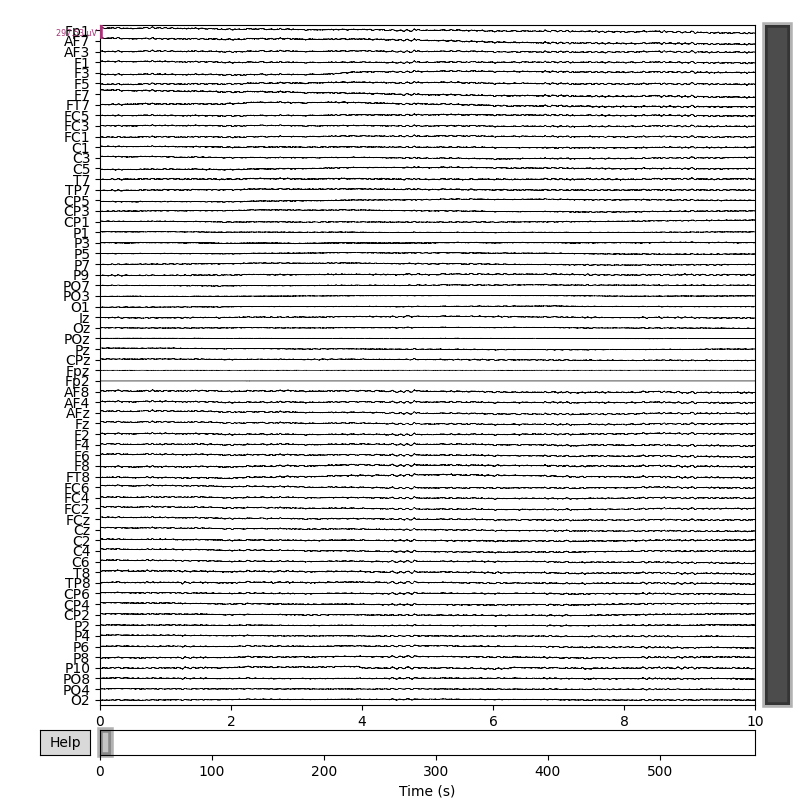
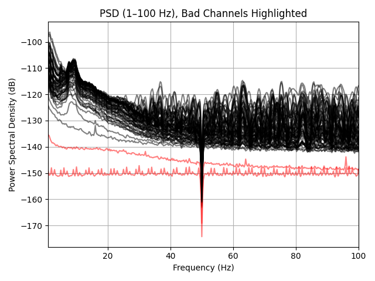
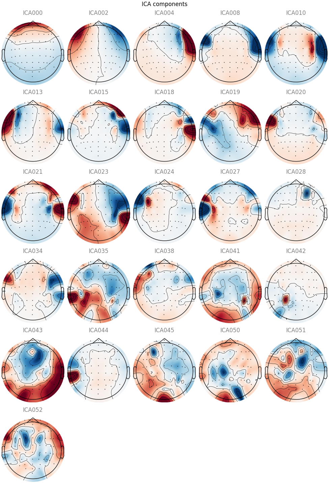
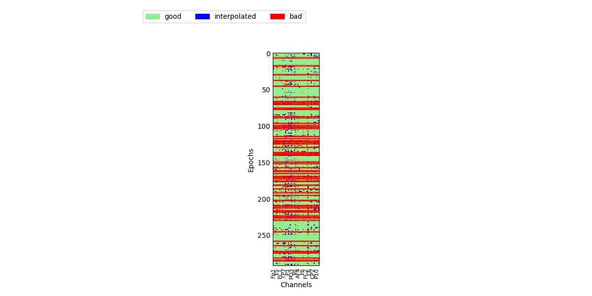
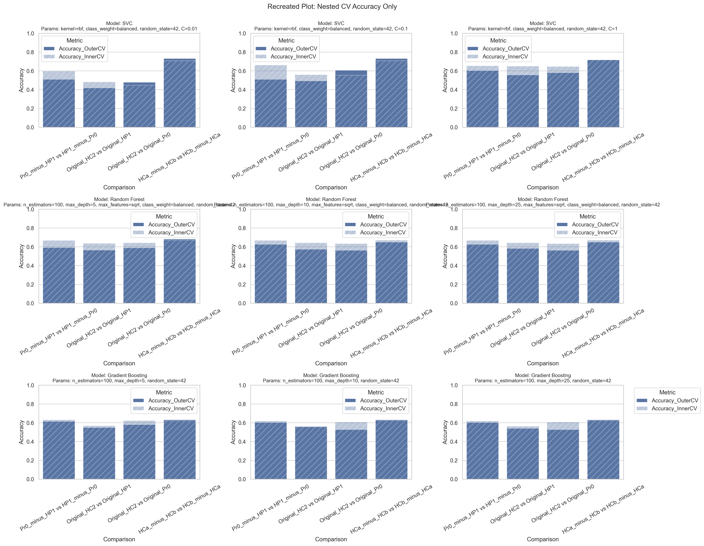

# Twin Resting-State EEG — Schizophrenia Biomarker Exploration

A full EEG analysis pipeline for a twin study investigating schizophrenia biomarkers.
Raw EEG recordings are converted to BIDS format, preprocessed, source-localized,
and then transformed into spectral and connectivity features for machine learning classification.

---

## Clinical Groups

| Code | Description |
|---|---|
| `Pr0` | Prodromes (at-risk participants) |
| `HP1` | High-risk healthy co-twins of Pr0 |
| `HC2` | Healthy controls |

The ML pipeline compares discordant twin pairs (`Pr0 vs HP1`) and healthy controls (`HC2 vs HP1`, `HC2 vs Pr0`).

---

## Folder Structure

```
├── BIDS/                          # BIDS-compliant EEG metadata
│   ├── participants.tsv           # Subject demographics & clinical labels
│   ├── participants.json          # Column descriptions for participants.tsv
│   └── dataset_description.json  # Dataset-level metadata
│
├── Raws/                          # Input: raw .fif EEG recordings
├── Raw_edf/                       # Intermediate: converted .edf files
│
├── Preprocessed/
│   ├── Continuous/                # Cleaned continuous EEG (.fif)
│   ├── Epoched/                   # Cleaned epoched EEG (.fif)
│   ├── Plots/                     # QC plots and per-subject metadata
│   ├── Source/                    # Source localization outputs (STC, ROI CSVs)
│   │   └── fs_templates/          # fsaverage brain template (required by script 2)
│   ├── Connectivity_wPLI_bands/   # wPLI matrices per subject per band
│   ├── PowerAndFoooF/             # FOOOF spectral feature CSVs per subject
│   └── Features/                  # Aggregated feature tables (input to ML)
│
├── Outputs ML/                    # ML results: all features
│   ├── Only Connectivity/         # ML results: connectivity features only
│   └── Only Spectra/              # ML results: spectral features only
│
├── Scripts/                       # All analysis scripts (see below)
├── Figures/AUC/                   # AUC output figures
└── assets/                        # Example output figures (used in this README)
```

---

## Setup

### 1. Set your data path

Every script defines a `BASE_DIR` variable near the top:

```python
BASE_DIR = r"P:\YOUR_DATA_PATH_HERE"  # TODO: Set this to your project data directory
```

Replace `P:\YOUR_DATA_PATH_HERE` with the absolute path to your local data root —
the folder that contains `Raws/`, `Preprocessed/`, etc.

> **Script 0 only** also requires `EXCEL_PATH` to point to the participants Excel file
> (used to generate `participants.tsv`).

### 2. Required external files before running

| File/Folder | Required by | Notes |
|---|---|---|
| `Raws/*.fif` | Scripts 0, 1 | Raw EEG recordings |
| `Preprocessed/Source/fs_templates/fsaverage/` | Script 2 | Download via `mne.datasets.fetch_fsaverage()` |
| `Preprocessed/PowerAndFoooF/*_features.csv` | Script 5-1 | Must be generated by recreating script 4 (see below) |

### 3. Install dependencies

```bash
pip install -r requirements.txt
```

---

## Pipeline — Scripts in Execution Order

### `0_BIDS.py` — Convert to BIDS

Converts raw `.fif` files to `.edf` and organises them into a BIDS-compliant folder structure.
Also generates `BIDS/participants.tsv` from an Excel metadata file.

**Input:** `Raws/*.fif`, participants Excel file  
**Output:** `Raw_edf/`, `BIDS/`, `BIDS/participants.tsv`

---

### `1_PreprocessingRT2.0.py` — EEG Preprocessing

Full preprocessing pipeline per subject:
resampling (256 → 256 Hz), bandpass filter (1–100 Hz), notch filter (50 Hz),
bad channel detection and interpolation, ICA with ICLabel (brain components only),
AutoReject epoch cleaning, and QC reports.

**Input:** `Raws/*_raw.fif`  
**Output:** `Preprocessed/Continuous/`, `Preprocessed/Epoched/`, `Preprocessed/Plots/`

<table>
  <tr>
    <td align="center"><br><em>Raw EEG overview</em></td>
    <td align="center"><br><em>PSD with bad channels highlighted</em></td>
  </tr>
  <tr>
    <td align="center"><br><em>ICA brain components retained</em></td>
    <td align="center"><br><em>AutoReject epoch rejection log</em></td>
  </tr>
</table>

---

### `2_SourceLocalization.py` — Source Localization

Applies dSPM inverse modelling (fsaverage template, oct6 source space, 3-layer BEM)
to produce cortical ROI time courses using the aparc parcellation.

**Input:** `Preprocessed/Continuous/*_preprocessed_raw.fif`  
**Output:** `Preprocessed/Source/` (STC files + `*_roi_timecourses.csv` per subject)

---

### `3_wPLI.py` — Functional Connectivity

Computes pairwise weighted Phase Lag Index (wPLI) between all ROIs
for 5 EEG frequency bands (delta, theta, alpha, beta, gamma).

**Input:** `Preprocessed/Source/*_roi_timecourses.csv`  
**Output:** `Preprocessed/Connectivity_wPLI_bands/` (per-subject matrices + heatmaps)

---

### `4_Power&FOOOF.py` — Spectral Feature Extraction ⚠️ Script lost

This script is no longer available and must be recreated.
It computed Welch PSDs per ROI/channel, fitted them with FOOOF, and saved one CSV per subject.

**Expected output per subject:** `Preprocessed/PowerAndFoooF/<subID>_features.csv`  
One row per channel, with columns:

| Group | Columns |
|---|---|
| Subject info | `subject_id`, `channel` |
| Aperiodic | `aperiodic_offset`, `aperiodic_exponent`, `r_squared`, `fit_error` |
| Band power | `delta_lin`, `delta_dB`, `theta_lin`, `theta_dB`, `alpha_lin`, `alpha_dB`, `beta_lin`, `beta_dB`, `gamma_lin`, `gamma_dB` |
| Spectral peaks | `CF_delta`, `PW_delta`, `BW_delta` … (same for theta, alpha, beta, gamma) |

**See:** `README INSTRUCTIONS PROCESSING SCRIPTS.txt` for the full reconstruction guide.

---

### `5_1_PuttingFeaturesTogether_Power.py` — Aggregate Spectral Features

Assigns channels to ROIs, selects the strongest peak per frequency band,
and produces per-channel, per-ROI, and subject-level wide-format tables.

**Input:** `Preprocessed/PowerAndFoooF/*_features.csv`  
**Output:** `Preprocessed/Features/fooof_AllChannels.csv`, `fooof_AllROIs.csv`, `fooof_FinalWide_perSubject.csv`

---

### `5_2_PuttingFeaturesTogether_Connectivity.py` — Aggregate Connectivity Features

Flattens wPLI matrices into long-format and wide-format feature tables
(one row per subject, one column per ROI pair × frequency band).

**Input:** `Preprocessed/Connectivity_wPLI_bands/`  
**Output:** `Preprocessed/Features/all_subjects_wpli_longformat.csv`, `wpli_features_wide.csv`

---

### `5_3_PuttingFeaturesTogether_wplifooof.py` — Merge Feature Sets

Joins the FOOOF and wPLI wide-format tables on `subject_id`
and writes a summary log of the combined feature space.

**Input:** `fooof_FinalWide_perSubject.csv`, `wpli_features_wide.csv`  
**Output:** `Preprocessed/Features/combined_features_wide.csv`, `combined_features_summary_log.txt`

---

### `5_4_Adding subject data.py` — Attach Demographics

Merges subject metadata from `BIDS/participants.tsv` into the feature matrix.

**Input:** `combined_features_wide.csv`, `BIDS/participants.tsv`  
**Output:** `Preprocessed/Features/combined_features_wide_SubjectInfo.csv`

---

### `6_ML_Final.py` — Machine Learning (all features)

Full ML pipeline: feature selection → PCA (95 % variance, ~117 components from 11 844)
→ nested cross-validation (5-fold outer, 3-fold inner with sequential forward selection)
using SVC, Random Forest, and Gradient Boosting on four group contrasts.

> **Note:** Code after the `SECTION 6 (FINAL)` marker was not validated
> and should be ignored (see `README INSTRUCTIONS ML SCRIPTS.txt`).

**Input:** `Preprocessed/Features/combined_features_wide_SubjectInfo.csv`  
**Output:** `Outputs ML/` (CSV summary + PNG plots, `Diff_Top_Feature_Contributions.csv`, `Diff_PCA_Detailed_Contributions.json`)

---

### `6_ML_Final_connectivity.py` — ML (connectivity features only)

Identical pipeline to `6_ML_Final.py`, restricted to wPLI connectivity features.

**Output:** `Outputs ML/Only Connectivity/`

---

### `6_ML_Final_periodic.py` — ML (spectral features only)

Identical pipeline to `6_ML_Final.py`, restricted to periodic/bandpower features.

**Output:** `Outputs ML/Only Spectra/`

---

## Key Results (from `README ML EXPLORATION.txt`)

| Comparison | Best outer CV accuracy |
|---|---|
| Pr0 vs HP1 (twin-difference) | ~0.63 (Random Forest) |
| HC2 vs HP1 | ~0.58 (Random Forest) |
| HC2 vs Pr0 | ~0.59 (SVC / Gradient Boosting) |
| HCa vs HCb (healthy twin pairs) | ~0.73 (SVC) ⚠️ not robust across seeds |

Overall accuracies are modest. The HC twin contrast result should be interpreted with caution
due to small sample size (n = 30 pairs).

**Nested CV accuracy across classifiers and comparisons (all features):**



---

## Documentation

| File | Contents |
|---|---|
| `README INSTRUCTIONS PROCESSING SCRIPTS.txt` | Detailed docs for scripts 0–5 |
| `README INSTRUCTIONS ML SCRIPTS.txt` | Detailed docs for `6_ML_Final.py` |
| `README ML EXPLORATION.txt` | Full results table and ML exploration notes |
